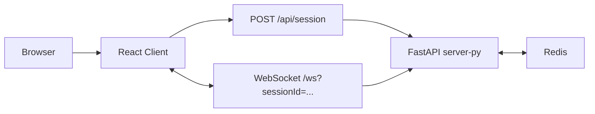

# SKLinkChat Architecture

## Overview

当前仓库只保留一个活跃运行时：

- `client/`：React 18 + Vite 前端
- `server-py/`：FastAPI WebSocket/HTTP 后端
- `redis`：在线状态、会话存在性与实时协调

## Runtime Topology



## Active Contracts

- `POST /api/session`
- `GET /healthz`
- `GET /readyz`
- `GET /api/users/count`
- `GET /ws?sessionId=<session_id>`

## Frontend Structure

```text
client/src/
  app/
  pages/
  features/
    chat/
      api/
      hooks/
      model/
      services/
      ui/
    settings/
      model/
      ui/
    presence/
      api/
      ui/
  shared/
    api/
    config/
    i18n/
    lib/
    ui/
    types/
```

### Frontend Ownership

- `app/`：根组件、providers、layout、store 组合
- `pages/`：页面容器和布局状态
- `features/chat/`：session bootstrap、socket transport、chat store/UI
- `features/settings/`：昵称、关键字、语言设置
- `features/presence/`：在线人数查询与展示
- `shared/`：无业务归属的公共能力

## Backend Structure

```text
server-py/app/
  bootstrap/
  presentation/
    http/
      routes/
    ws/
  application/
    chat/
    platform/
  domain/
    chat/
    platform/
  infrastructure/
    redis/
    realtime/
    observability/
    jobs/
  shared/
```

### Backend Ownership

- `bootstrap/`：应用工厂、依赖装配、lifespan
- `presentation/http/routes/`：HTTP transport layer
- `presentation/ws/`：WebSocket endpoint layer
- `application/chat/`：聊天 use cases 与 orchestration
- `application/platform/`：ports 与平台级 use cases
- `domain/chat/`：`ChatSession`、`MatchResult` 等领域模型
- `infrastructure/redis/`：session、presence、readiness、event bus 适配器
- `infrastructure/realtime/`：单实例内存连接中心
- `infrastructure/observability/`：审计 sink
- `infrastructure/jobs/`：内联任务分发器
- `shared/`：配置、日志、协议、错误定义

## Active Request Flow

### Session bootstrap

1. 前端调用 `POST /api/session`
2. 后端返回匿名 `session_id`
3. 前端通过 `ws://.../ws?sessionId=...` 建立连接

### Match flow

1. 用户点击开始聊天
2. 前端发送 `{ type: "queue", payload: ... }`
3. 后端把会话置为 `searching`
4. 运行时从等待队列中取出两个在线会话
5. 双方收到 `user-info` 和 `match`

### Message flow

1. 前端发送 `message`
2. FastAPI 校验当前 partner
3. 消息转发到目标会话
4. 本地消息也写入前端 store

### Reconnect flow

1. 刷新页面后，浏览器保留同一个 `sessionId`
2. 后端在恢复窗口内保留该会话
3. 用户重新进入时自动附着回原会话
4. 超过 `SERVER_PY_RECONNECT_WINDOW_SECONDS` 未恢复，服务端才真正清理并通知对端

## Active Protocol

当前活跃事件：

- `message`
- `user-info`
- `error`
- `queue`
- `match`
- `disconnect`
- `typing`

## Deployment

推荐本地联调方式：

```bash
docker compose up -d --build
```

服务：

- `client`
- `server-py`
- `redis`

## Verification

```bash
cd server-py && ./.venv/bin/python -m pytest -q
cd server-py && ./.venv/bin/ruff check .
cd server-py && python -m compileall app tests
cd client && npm run test -- --run
cd client && npm run build
docker compose config
```

## Key Files

- [client/src/app/App.tsx](/Users/lizhenwei/Documents/SKLinkChat/client/src/app/App.tsx)
- [client/src/features/chat/chat-provider.tsx](/Users/lizhenwei/Documents/SKLinkChat/client/src/features/chat/chat-provider.tsx)
- [client/src/features/chat/hooks/use-chat-socket.ts](/Users/lizhenwei/Documents/SKLinkChat/client/src/features/chat/hooks/use-chat-socket.ts)
- [client/src/features/presence/api/get-online-count.ts](/Users/lizhenwei/Documents/SKLinkChat/client/src/features/presence/api/get-online-count.ts)
- [server-py/app/main.py](/Users/lizhenwei/Documents/SKLinkChat/server-py/app/main.py)
- [server-py/app/bootstrap/app_factory.py](/Users/lizhenwei/Documents/SKLinkChat/server-py/app/bootstrap/app_factory.py)
- [server-py/app/presentation/http/routes/session.py](/Users/lizhenwei/Documents/SKLinkChat/server-py/app/presentation/http/routes/session.py)
- [server-py/app/presentation/http/routes/health.py](/Users/lizhenwei/Documents/SKLinkChat/server-py/app/presentation/http/routes/health.py)
- [server-py/app/presentation/ws/chat_endpoint.py](/Users/lizhenwei/Documents/SKLinkChat/server-py/app/presentation/ws/chat_endpoint.py)
- [server-py/app/application/chat/runtime_service.py](/Users/lizhenwei/Documents/SKLinkChat/server-py/app/application/chat/runtime_service.py)
