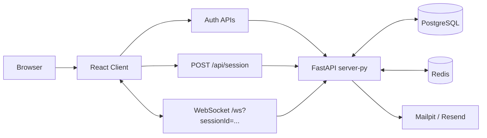

# SKLinkChat Architecture

## Overview

当前系统采用“PostgreSQL 持久化 + Redis 实时协调”的双存储模型：

- `client/`: React 18 + Vite 前端
- `server-py/`: FastAPI HTTP/WebSocket 后端
- `postgres`: 账号、认证、验证令牌、聊天持久化、审计与风险记录
- `redis`: 在线状态、等待队列、实时 chat session、断线恢复窗口
- `mailpit`: 本地开发邮件收件箱

## Runtime Topology



## Ownership Boundaries

### PostgreSQL owns

- `accounts`
- `account_interests`
- `auth_sessions`
- `email_verification_tokens`
- `registration_risk_events`
- `chat_sessions`
- `chat_matches`
- `chat_messages`
- `chat_reports`
- `audit_events`

### Redis owns

- online presence
- waiting queue
- websocket runtime session state
- reconnect deadlines
- recent in-memory chat history for live UX

## Auth and Chat Gating

### Registration flow

1. Client submits email, password, display name, interests, Turnstile token
2. Backend verifies Turnstile using the configured provider
3. Backend creates account and risk event
4. Backend creates a 7-day `HttpOnly` auth session cookie
5. Backend sends a single-use verification link

### Verification flow

1. User opens email link containing verification token
2. Frontend calls `POST /api/auth/verify-email`
3. Backend validates token hash, 15-minute expiry, revocation, and single-use status
4. Backend sets `email_verified_at` and invalidates the link immediately
5. Logged-in but unverified users may call `POST /api/auth/resend-verification` with cooldown and hourly limit protection

### Chat bootstrap flow

1. Verified authenticated user calls `POST /api/session`
2. Backend creates or reuses the single active account-owned anonymous chat session row in PostgreSQL
3. Frontend opens `/ws?sessionId=...`
4. Backend authorizes both cookie session and `sessionId` ownership before accepting websocket
5. Redis runtime handles queueing, matching, typing, disconnect, reconnect

## Hardening Invariants

- One account may own at most one active `chat_session`
- One `chat_session` may participate in at most one active `chat_match`
- Both invariants are enforced by PostgreSQL partial unique indexes plus application-level transactions/locking
- `chat_messages` persist `message_type`, `sender_display_name_snapshot`, and optional `client_message_id`
- `(chat_match_id, client_message_id)` is unique when `client_message_id` is present, which suppresses duplicate durable writes on retries/reconnects
- Reports are intentionally minimal in V1: only the current active match partner can be reported

## Privacy Rules

- Peer-visible websocket payloads only include `session_id`, `display_name`, `state`
- `email` and `account_id` never appear in client session payloads or peer-facing transport events
- Auth session token and verification token are stored hashed, never raw
- 前后端都不暴露 `language` 字段，也不把 `interests` 作为当前匹配条件

## Retention

- `chat_messages`: 30 days
- `email_verification_tokens`: 15 minutes validity, single use
- `registration_risk_events`: 180 days
- `audit_events`: 365 days

第一版 retention 使用应用内定时任务，不引入外部 worker。

## Abuse Reporting

- Endpoint: `POST /api/chat/reports`
- Scope: only the current active match partner
- Allowed reasons: `harassment`, `sexual_content`, `spam`, `hate_speech`, `other`
- Storage: `reason` + optional `details`
- Constraint: `other` requires non-empty `details`

## Local Deployment

```bash
docker compose up -d postgres redis mailpit
cd server-py && alembic upgrade head
cd server-py && ./.venv/bin/python -m pytest -q
cd client && npm run test -- --run
```

## Future Extension Boundary

- 未来论坛功能可以复用 `accounts` 和审计/风险基础设施
- 论坛必须新增独立 `forum_*` 表
- 当前 `chat_*` 表只服务 1:1 匿名聊天，不复用为论坛帖子模型
- 当前版本不支持历史会话补举报，不支持基于 `interests` 的 hard match 过滤
