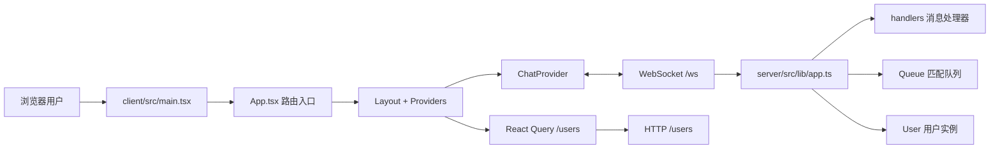
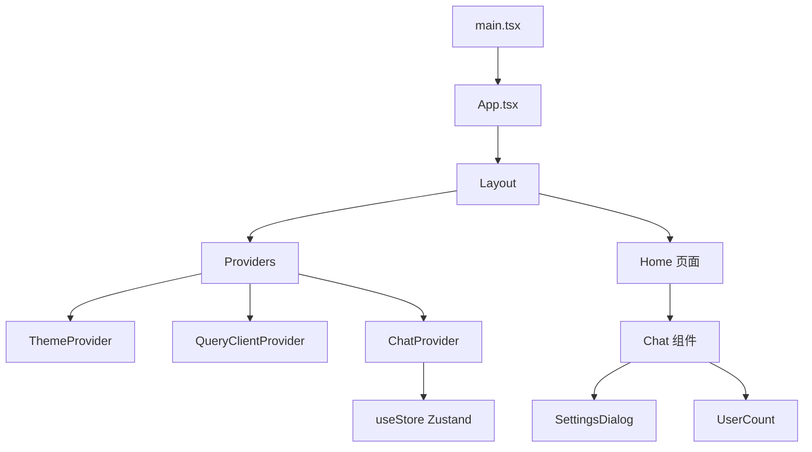
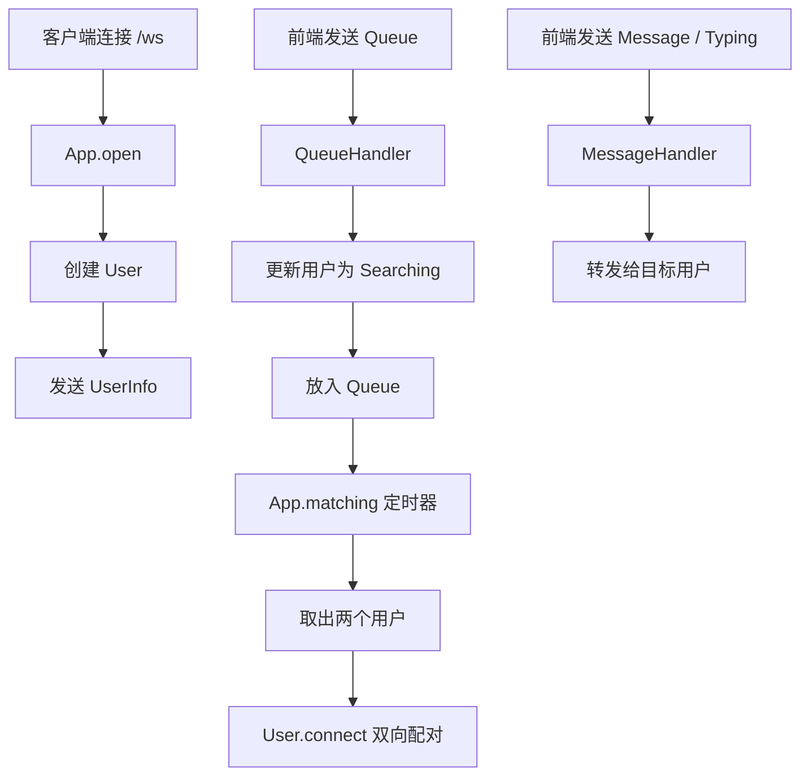

# SKLinkChat 项目架构梳理

## 1. 项目概览

SKLinkChat 是一个“匿名文字聊天”项目，整体分成两个独立子系统：

- `client/`：前端界面，负责页面渲染、状态管理、国际化、主题切换、聊天输入与 WebSocket 通信。
- `server/`：后端服务，负责 WebSocket 连接管理、用户状态维护、匹配队列、消息转发和在线用户接口。

这个项目的核心思路很清晰：

1. 前端启动后创建 React 应用。
2. 前端通过 WebSocket 和后端保持实时连接。
3. 后端为每个连接创建一个 `User` 实例。
4. 用户点击开始聊天后进入匹配队列。
5. 后端定时从队列里取出两个用户进行匹配。
6. 匹配成功后，双方通过同一个后端服务转发消息和输入状态。

## 2. 技术栈

### 前端

- `React 18`
- `TypeScript`
- `Vite`
- `React Router`
- `Zustand`
- `react-query`
- `react-use-websocket`
- `Tailwind CSS`
- `Radix UI`
- `react-hook-form`
- `zod`

### 后端

- `Bun`
- `TypeScript`
- `WebSocket`（Bun 原生能力）
- `lodash`
- `unique-username-generator`

## 3. 总体目录结构

```text
SKLinkChat/
├── AGENTS.md
├── ARCHITECTURE.md
├── README.md
├── client/
│   ├── .eslintrc.cjs
│   ├── .gitignore
│   ├── .prettierrc.cjs
│   ├── README.md
│   ├── bun.lockb
│   ├── components.json
│   ├── index.html
│   ├── package.json
│   ├── postcss.config.js
│   ├── public/
│   │   └── vite.svg
│   ├── src/
│   │   ├── App.tsx
│   │   ├── main.tsx
│   │   ├── vite-env.d.ts
│   │   ├── assets/
│   │   ├── components/
│   │   ├── hooks/
│   │   ├── lib/
│   │   ├── providers/
│   │   └── types/
│   ├── tailwind.config.js
│   ├── tsconfig.json
│   ├── tsconfig.node.json
│   └── vite.config.ts
├── server/
│   ├── .eslintrc.cjs
│   ├── .gitignore
│   ├── .prettierrc.cjs
│   ├── .todo
│   ├── .vscode/
│   │   └── server.code-workspace
│   ├── Dockerfile
│   ├── README.md
│   ├── bun.lockb
│   ├── package.json
│   ├── src/
│   │   ├── index.ts
│   │   ├── lib/
│   │   └── types.ts
│   └── tsconfig.json
└── .sisyphus/
```

## 4. 架构分层说明

### 4.1 前端分层

- **入口层**：`main.tsx`、`App.tsx`
- **Provider 层**：统一注入主题、聊天连接、通知、查询能力
- **状态层**：`zustand` 切片管理聊天、用户、设置
- **页面层**：`pages/` 负责完整页面
- **组合组件层**：`molecules/` 负责把业务 UI 组合起来
- **基础组件层**：`ui/` 负责封装通用 UI 原件
- **工具层**：`lib/`、`hooks/`、`types/` 提供配置、翻译、类型和帮助函数

### 4.2 后端分层

- **入口层**：`server/src/index.ts`
- **应用核心层**：`server/src/lib/app.ts`
- **领域模型层**：`user.ts`、`queue.ts`
- **消息处理层**：`handlers/` 下各类处理器
- **协议层**：`types.ts`、`response.ts`

## 5. 系统整体交互图



## 6. 前端运行流程图



## 7. 后端匹配与消息流图



## 8. 核心模块作用

### 8.1 `client/` 的作用

前端是项目的交互层，负责：

- 展示匿名聊天界面
- 维护当前用户与陌生人的显示状态
- 通过 WebSocket 收发消息
- 通过 HTTP 查询在线人数
- 管理主题、语言与聊天偏好

### 8.2 `server/` 的作用

后端是项目的实时通信和匹配中枢，负责：

- 接收浏览器 WebSocket 连接
- 维护连接用户列表
- 为每个用户分配随机昵称
- 组织匹配队列并定时配对
- 转发聊天消息与“正在输入”状态
- 处理断开连接与在线人数查询

## 9. 逐文件说明

> 说明范围：这里只解释项目中的一方文件。
>
> 默认不展开 `node_modules/`、`dist/`、`.git/` 等第三方或生成目录；它们不属于项目手写架构的一部分。

### 9.1 根目录文件

- `README.md`：项目入口说明，目前内容很少，主要起项目命名标识作用。
- `AGENTS.md`：仓库工作规范文件，描述目录建议、命令习惯、测试与提交流程等约束。
- `ARCHITECTURE.md`：本次新增的中文架构文档，用于系统化梳理项目结构、职责和文件说明。

### 9.2 `client/` 配置与静态文件

- `client/package.json`：前端依赖与脚本入口，定义 `dev`、`build`、`lint`、`preview` 命令。
- `client/vite.config.ts`：Vite 构建配置，主要负责 React SWC 插件和 `@` 路径别名。
- `client/tsconfig.json`：前端 TypeScript 主配置，限制严格模式和路径解析。
- `client/tsconfig.node.json`：Node/Vite 配置文件对应的 TypeScript 配置。
- `client/tailwind.config.js`：Tailwind 主题、颜色变量、暗色模式和动画配置。
- `client/postcss.config.js`：PostCSS 插件声明，启用 Tailwind 与 Autoprefixer。
- `client/components.json`：`shadcn/ui` 组件生成配置，描述样式风格和别名映射。
- `client/index.html`：前端 HTML 壳文件，提供根节点 `#root` 和页面标题。
- `client/.eslintrc.cjs`：前端 ESLint 配置。
- `client/.prettierrc.cjs`：前端 Prettier 格式化规则。
- `client/.gitignore`：前端目录忽略规则，避免提交构建产物、日志与本地环境文件。
- `client/README.md`：Vite 模板自带说明，主要是脚手架残留文档。
- `client/bun.lockb`：前端依赖锁文件，用于固定安装结果。
- `client/public/vite.svg`：公共静态图标资源。

### 9.3 `client/src/` 文件说明

#### 入口与全局

- `client/src/main.tsx`：React 挂载入口，加载全局样式并渲染 `App`。
- `client/src/App.tsx`：前端路由总入口，配置首页、欢迎页和 404 页面。
- `client/src/vite-env.d.ts`：Vite 类型声明文件，提供 `import.meta.env` 等类型支持。

#### 资源文件

- `client/src/assets/global.css`：全局样式与 CSS 变量定义，包含明暗主题颜色。
- `client/src/assets/react.svg`：默认图标资源，目前属于静态素材残留。

#### Provider 层

- `client/src/providers/index.tsx`：组合所有全局 Provider，包括查询、主题、聊天和通知。
- `client/src/providers/theme-provider.tsx`：主题上下文，负责 light/dark/system 切换与本地持久化。
- `client/src/providers/chat-provider.tsx`：聊天通信中枢，封装 WebSocket、消息分发、发送消息、开始匹配、修改昵称和输入状态同步。

#### 工具与配置层

- `client/src/lib/api.ts`：前端访问后端 REST 接口的最简 API 封装，目前用于获取在线用户列表。
- `client/src/lib/config.ts`：前端通用常量配置，目前定义在线人数刷新间隔。
- `client/src/lib/i18n.ts`：国际化字典、翻译函数和用户状态文案格式化逻辑。
- `client/src/lib/utils.ts`：通用工具函数 `cn`，用于合并 Tailwind 类名。

#### 状态管理层

- `client/src/lib/store/index.ts`：Zustand Store 总装配处，聚合聊天、设置、用户三个切片并启用 sessionStorage 持久化。
- `client/src/lib/store/chat.slice.ts`：聊天消息状态切片，负责消息列表追加和清空。
- `client/src/lib/store/users.slice.ts`：用户状态切片，维护“我”和“陌生人”的资料、输入状态和断开逻辑。
- `client/src/lib/store/settings.slice.ts`：设置状态切片，管理关键词偏好和界面语言。

#### 类型与 Hook

- `client/src/types/index.ts`：前端协议类型定义，统一消息结构、用户结构、用户状态和消息类型枚举。
- `client/src/hooks/useI18n.ts`：国际化便捷 Hook，读取当前语言并暴露翻译函数。

#### 页面层

- `client/src/components/pages/home.tsx`：主聊天页，负责匹配按钮、用户资料、当前对象信息和聊天区布局。
- `client/src/components/pages/welcome.tsx`：欢迎页，占位性质较强。
- `client/src/components/pages/not-found.tsx`：兜底错误页和 404 页面。

#### 模板层

- `client/src/components/template/layout.tsx`：页面总布局，挂载 Provider、头部、主体和底部。

#### 原子组件层

- `client/src/components/atoms/loading.tsx`：加载中旋转图标组件。

#### 组合组件层

- `client/src/components/molecules/chat.tsx`：聊天主组件，包含消息列表、输入表单、发送逻辑、输入中状态与滚动控制。
- `client/src/components/molecules/header.tsx`：顶部栏，展示项目标题与主题切换入口。
- `client/src/components/molecules/footer.tsx`：底部说明区，展示作者和源代码链接。
- `client/src/components/molecules/mode-toggle.tsx`：主题切换下拉菜单。
- `client/src/components/molecules/settings-dialog.tsx`：用户设置弹窗，负责昵称、关键词和语言修改。
- `client/src/components/molecules/user-count.tsx`：在线人数展示组件，定时轮询 `/users` 接口。

#### 通用 UI 组件层

- `client/src/components/ui/alert-dialog.tsx`：基于 Radix 的警告弹窗封装。
- `client/src/components/ui/badge.tsx`：标签组件封装。
- `client/src/components/ui/button.tsx`：按钮组件封装，支持多种样式和尺寸。
- `client/src/components/ui/dialog.tsx`：普通对话框组件封装。
- `client/src/components/ui/dropdown-menu.tsx`：下拉菜单组件封装。
- `client/src/components/ui/form.tsx`：表单上下文封装，衔接 `react-hook-form` 与 UI 展示。
- `client/src/components/ui/input.tsx`：输入框组件封装。
- `client/src/components/ui/label.tsx`：表单标签组件封装。
- `client/src/components/ui/textarea.tsx`：多行输入组件封装。
- `client/src/components/ui/toast.tsx`：通知消息组件封装。
- `client/src/components/ui/toaster.tsx`：通知容器渲染组件。
- `client/src/components/ui/use-toast.ts`：通知状态管理 Hook 和调度逻辑。

### 9.4 `server/` 配置与支撑文件

- `server/package.json`：后端依赖与启动命令定义。
- `server/tsconfig.json`：后端 TypeScript 配置。
- `server/Dockerfile`：后端容器化构建脚本。
- `server/.eslintrc.cjs`：后端 ESLint 配置。
- `server/.prettierrc.cjs`：后端 Prettier 配置。
- `server/.gitignore`：后端目录忽略规则。
- `server/README.md`：Bun 初始化后的基础说明文档。
- `server/.todo`：后端未来功能清单，例如 Redis、多地区匹配、小游戏和表情动画。
- `server/.vscode/server.code-workspace`：VS Code 工作区配置，定义自动整理导入和修复动作。
- `server/bun.lockb`：后端依赖锁文件。

### 9.5 `server/src/` 文件说明

#### 后端入口

- `server/src/index.ts`：后端启动入口，读取端口并启动应用实例。

#### 协议与类型

- `server/src/types.ts`：后端 WebSocket 相关类型、用户状态和协议消息枚举。

#### 基础能力

- `server/src/lib/response.ts`：统一 WebSocket 响应序列化工具。
- `server/src/lib/queue.ts`：简单队列结构，用于管理等待匹配的用户 ID。
- `server/src/lib/user.ts`：用户领域模型，封装随机昵称、状态更新、序列化、配对和断开逻辑。
- `server/src/lib/app.ts`：后端核心应用类，负责 HTTP 路由、WebSocket 生命周期、客户端池、心跳保活、队列匹配和处理器分发。

#### 处理器体系

- `server/src/lib/handlers/handler.ts`：处理器抽象基类，规定支持的消息类型和处理入口。
- `server/src/lib/handlers/index.ts`：集中导出所有处理器。
- `server/src/lib/handlers/message.ts`：处理聊天消息与“正在输入”状态，并将其转发给目标用户。
- `server/src/lib/handlers/queue.ts`：处理加入队列、重新匹配、断开当前对象等逻辑。
- `server/src/lib/handlers/user.ts`：处理用户资料更新，如昵称同步。

## 10. 关键设计特点

### 10.1 前后端通信双轨制

- `WebSocket`：用于实时聊天、匹配、输入状态同步。
- `HTTP /users`：用于展示在线人数，避免把简单统计也塞进长连接协议。

### 10.2 前端状态分片明确

前端把状态拆成三个切片：

- `chat.slice.ts`：聊天消息
- `users.slice.ts`：当前用户与陌生人
- `settings.slice.ts`：偏好设置

这样做的优点是维护边界清楚，后续扩展音视频、过滤条件或更多用户设置时也更容易扩展。

### 10.3 后端采用处理器分发模式

后端没有把所有消息处理塞进一个超大 `switch`，而是通过 `Handler` 抽象类，把不同类型消息拆成多个处理器：

- `MessageHandler`
- `QueueHandler`
- `UserHandler`

这样后续新增新消息类型时，扩展成本更低。

## 11. 当前项目适合改进的板块

这部分只做“定位说明”，不直接改代码：

- **文档层**：原始 `README.md` 信息过少，后续可把运行方式和部署方式补全。
- **前端体验层**：欢迎页、404 页目前很轻量，可继续补充更强引导。
- **状态同步层**：目前关键词只保存在前端设置中，尚未真正参与后端匹配。
- **后端扩展层**：`.todo` 中提到 Redis、多服务器扩展、关键词匹配、游戏与表情系统。
- **工程质量层**：当前没有测试框架与 CI，可在后续迭代补充。

## 12. 总结

SKLinkChat 的结构并不复杂，但分层已经比较明确：

- 前端负责展示与交互
- 后端负责连接、匹配和消息分发
- 协议通过 `PayloadType` 保持统一
- 核心路径集中在 `client/src/providers/chat-provider.tsx` 与 `server/src/lib/app.ts`

如果后续要继续改进，建议优先关注以下几个文件：

- `client/src/providers/chat-provider.tsx`
- `client/src/components/molecules/chat.tsx`
- `client/src/lib/store/index.ts`
- `server/src/lib/app.ts`
- `server/src/lib/user.ts`
- `server/src/lib/handlers/queue.ts`

这几处基本决定了“连接、匹配、聊天、状态同步”的主链路。
