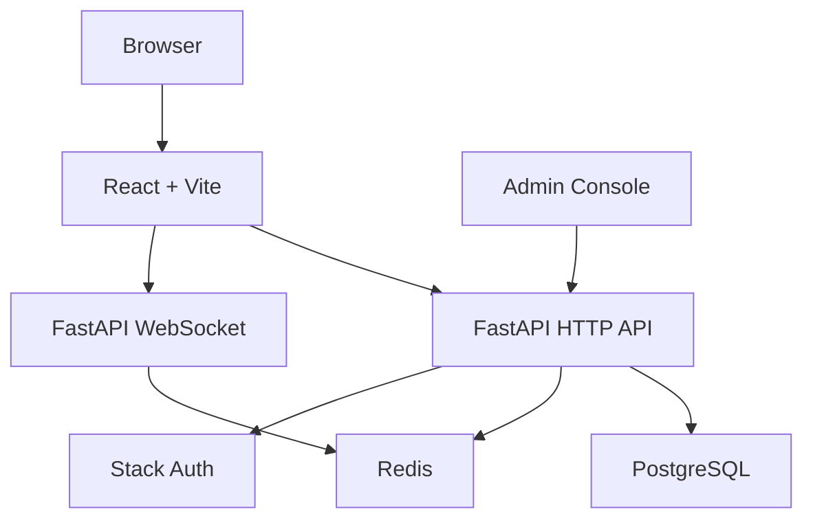

# SKLinkChat

<p align="center">
  <strong>Anonymous real-time chat system with moderation, audit trails, Stack Auth, FastAPI, React, PostgreSQL, Redis, and Docker.</strong>
</p>

<p align="center">
  <a href="https://github.com/BarbieWinter/SKLinkChat/actions/workflows/ci.yml"></a>
  
  
  
  
  
  
  
</p>

<p align="center">
  <a href="#english">English</a> ·
  <a href="#zh-cn">中文</a> ·
  <a href="#local-preview">Local Preview</a> ·
  <a href="docs/DEPLOYMENT.md">Deployment</a> ·
  <a href="docs/ARCHITECTURE.md">Architecture</a> ·
  <a href="docs/ROADMAP.md">Roadmap</a>
</p>

<a id="english"></a>

## English

SKLinkChat is a full-stack anonymous chat project for real-time matching, private conversation, reporting, moderation, and admin audit workflows. It is useful as a practical reference for building a real-time community product, not just a single chat screen.

<p align="center">
  
</p>

**Why this project exists:** anonymous chat products are easy to prototype but hard to operate responsibly. SKLinkChat keeps the fun real-time interaction, while adding login, reports, account restrictions, audit logs, and a maintainable backend boundary.

Quick start:

```bash
git clone https://github.com/BarbieWinter/SKLinkChat.git
cd SKLinkChat
cp .env.example .env
docker compose up --build
```

Open `http://localhost:4173`.

More English details:

- [Deployment guide](docs/DEPLOYMENT.md)
- [Architecture](docs/ARCHITECTURE.md)
- [Roadmap](docs/ROADMAP.md)
- [Contributing](CONTRIBUTING.md)
- [Security](SECURITY.md)

<a id="zh-cn"></a>

## 中文

SKLinkChat 是一套匿名实时聊天全栈项目，覆盖随机匹配、私密聊天、举报、审核、审计、登录、本地部署和基础工程治理。它的目标不是做一个孤立的聊天页面，而是提供一个能被阅读、运行、改造和继续扩展的真实参考项目。

如果这个项目对你有帮助，欢迎给一个 star。star 会帮助更多开发者发现这个项目。

<p align="center">
  
</p>

## 为什么做这个项目

匿名聊天的核心难点不只是“把消息发出去”，还包括：

- 如何处理登录态和匿名身份之间的边界。
- 如何让实时匹配、在线状态和 WebSocket 连接保持清晰。
- 如何给举报、封禁、恢复和审计留下后台治理入口。
- 如何让新开发者用 Docker 或本地命令快速跑起来。

SKLinkChat 把这些能力放在同一个仓库里，适合作为实时聊天、社区治理、FastAPI 后端和 React 前端组合项目的参考。

## 项目亮点

- 匿名实时聊天：基于 WebSocket 的会话消息链路。
- 认证链路：Stack Auth 登录，并同步成本地 session。
- 数据持久化：PostgreSQL 保存账号、会话、举报、限制和审计日志。
- 实时状态：Redis 支撑在线状态、匹配状态和事件协调。
- 管理后台：支持举报审核、账号限制、账号恢复和审计查询。
- 一键本地演示：Docker Compose 拉起 PostgreSQL、Redis、后端和前端。
- 开源友好：MIT License、CI、Issue 模板、PR 模板、贡献指南和安全说明。

<a id="local-preview"></a>

## 本地演示

最快方式：

```bash
git clone https://github.com/BarbieWinter/SKLinkChat.git
cd SKLinkChat
cp .env.example .env
docker compose up --build
```

打开：

- 前端预览：`http://localhost:4173`
- API 健康检查：`http://localhost:8000/healthz`
- Stack Auth 路由：`http://localhost:4173/auth/stack`
- 管理后台举报页：`http://localhost:4173/admin/reports`
- 管理后台审计页：`http://localhost:4173/admin/audit`

> 当前没有公开托管演示站。本节是本地演示入口，避免新用户误以为存在在线演示站。

## 开发启动

```bash
make install
make dev
```

`make install` 会在需要时从 `.env.example` 创建根目录 `.env`，并安装后端与前端依赖。

常用命令：

```bash
make lint
make test
make build
make clean
```

完整部署和配置说明集中在 [docs/DEPLOYMENT.md](docs/DEPLOYMENT.md)。

## 技术栈

| 层级 | 技术 |
| --- | --- |
| 前端 | React 18, Vite, TypeScript, Zustand |
| 后端 | FastAPI, SQLAlchemy, Alembic, WebSocket |
| 数据库 | PostgreSQL 16 |
| 实时状态 | Redis 7 |
| 认证 | Stack Auth |
| 工程化 | Docker Compose, GitHub Actions |

## 架构概览



更完整的说明见 [docs/ARCHITECTURE.md](docs/ARCHITECTURE.md)。

## 管理员权限

管理员权限由数据库中的 `accounts.is_admin` 字段控制。

```sql
UPDATE accounts
SET is_admin = true
WHERE email_normalized = 'admin@example.com';
```

更新后重新请求 `/api/auth/session`，前端会拿到新的管理员状态。

## 文档导航

- [部署与配置](docs/DEPLOYMENT.md)
- [截图展示](docs/SCREENSHOTS.md)
- [路线图](docs/ROADMAP.md)
- [架构说明](docs/ARCHITECTURE.md)
- [代码地图](docs/CODEBASE_MAP.md)
- [开发命令](DEVELOPMENT.md)
- [贡献指南](CONTRIBUTING.md)
- [安全说明](SECURITY.md)
- [变更日志](CHANGELOG.md)

## License

SKLinkChat is released under the [MIT License](LICENSE).
