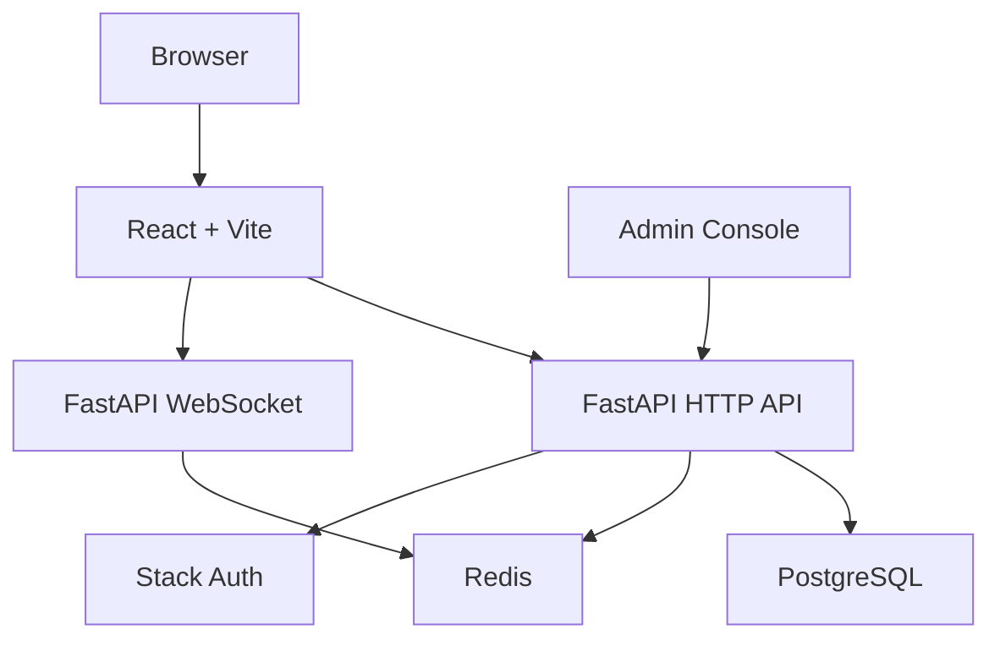

# SKLinkChat

<p align="center">
  <strong>Anonymous real-time chat with moderation, audit trails, Stack Auth, PostgreSQL, Redis, FastAPI, and React.</strong>
</p>

<p align="center">
  <a href="https://github.com/BarbieWinter/SKLinkChat/actions/workflows/ci.yml"></a>
  
  
  
  
  
  
  
</p>

<p align="center">
  <a href="#english">English</a> ·
  <a href="#中文">中文</a> ·
  <a href="#demo">Demo</a> ·
  <a href="docs/SCREENSHOTS.md">Screenshots</a> ·
  <a href="docs/ARCHITECTURE.md">Architecture</a> ·
  <a href="docs/ROADMAP.md">Roadmap</a>
</p>

## English

SKLinkChat is a full-stack anonymous chat system for real-time matching, private conversation, reporting, moderation, and admin audit workflows. It is built for developers who want a complete reference project instead of a single chat page.

If this project helps you, please give it a star. Stars help more developers discover the project.

## Preview

<p align="center">
  
</p>

## Why It Stands Out

- Real-time anonymous chat with WebSocket messaging.
- Stack Auth login flow with local session synchronization.
- PostgreSQL persistence for accounts, sessions, reports, restrictions, and audit logs.
- Redis-backed presence, matching state, and real-time coordination.
- Admin console for report review, account restriction, account recovery, and audit lookup.
- Docker Compose setup for local end-to-end demos.
- MIT License for open-source reuse.

## Demo

There is no public hosted demo yet. The fastest demo is the local Docker run:

```bash
git clone https://github.com/BarbieWinter/SKLinkChat.git
cd SKLinkChat
cp .env.example .env
docker compose up --build
```

Open:

- Frontend preview: `http://localhost:4173`
- API health check: `http://localhost:8000/healthz`
- Stack Auth route: `http://localhost:4173/auth/stack`
- Admin reports: `http://localhost:4173/admin/reports`
- Admin audit: `http://localhost:4173/admin/audit`

For contributor development, use the one-command installer:

```bash
make install
make dev
```

`make install` creates the root `.env` file from `.env.example` when needed and installs both backend and frontend dependencies.

More screenshots are collected in [docs/SCREENSHOTS.md](docs/SCREENSHOTS.md).

## Tech Stack

| Layer | Technology |
| --- | --- |
| Frontend | React 18, Vite, TypeScript, Zustand |
| Backend | FastAPI, SQLAlchemy, Alembic, WebSocket |
| Database | PostgreSQL 16 |
| Realtime state | Redis 7 |
| Auth | Stack Auth |
| DevOps | Docker Compose, GitHub Actions |

## Architecture



Read the full overview in [docs/ARCHITECTURE.md](docs/ARCHITECTURE.md).

## Local Development

Required:

- Node.js 18+
- Python 3.11+
- PostgreSQL 16
- Redis 7

Backend:

```bash
cd server-py
python3 -m venv .venv
source .venv/bin/activate
pip install -e ".[dev]"
cp ../.env .env
alembic upgrade head
uvicorn app.main:create_app --factory --reload --host 0.0.0.0 --port 8000
```

Frontend:

```bash
cd client
npm install
cp ../.env .env.local
npm run dev
```

Development URLs:

- Frontend: `http://localhost:5173`
- API: `http://localhost:8000`
- Health check: `http://localhost:8000/healthz`

## Common Commands

```bash
make install
make dev
make lint
make test
make build
make clean
```

## Documentation

- [Open Source Setup](docs/OPEN_SOURCE_SETUP.md)
- [Screenshots](docs/SCREENSHOTS.md)
- [Roadmap](docs/ROADMAP.md)
- [Architecture](docs/ARCHITECTURE.md)
- [Codebase Map](docs/CODEBASE_MAP.md)
- [Contributing](CONTRIBUTING.md)
- [Security](SECURITY.md)
- [Changelog](CHANGELOG.md)

## License

SKLinkChat is released under the [MIT License](LICENSE).

---

## 中文

SKLinkChat 是一套完整的匿名实时聊天系统，包含随机匹配、私密聊天、举报、审核、审计、登录和本地部署能力。它不是单页聊天 Demo，而是一个可以作为全栈参考项目阅读、运行和继续扩展的开源工程。

如果这个项目对你有帮助，欢迎给一个 star。star 会帮助更多开发者发现这个项目。

## 中文预览

<p align="center">
  
</p>

## 项目亮点

- 基于 WebSocket 的匿名实时聊天。
- Stack Auth 登录链路，并同步成本地会话。
- PostgreSQL 持久化账号、会话、举报、限制和审计日志。
- Redis 支撑在线状态、匹配状态和实时协调。
- 管理后台支持举报审核、账号限制、账号恢复和审计查询。
- Docker Compose 可快速启动本地完整演示环境。
- MIT License，便于开源复用。

## 一键运行

最快本地演示方式：

```bash
git clone https://github.com/BarbieWinter/SKLinkChat.git
cd SKLinkChat
cp .env.example .env
docker compose up --build
```

打开：

- 前端预览：`http://localhost:4173`
- API 健康检查：`http://localhost:8000/healthz`
- Stack Auth 路由：`http://localhost:4173/auth/stack`
- 管理后台举报页：`http://localhost:4173/admin/reports`
- 管理后台审计页：`http://localhost:4173/admin/audit`

如果你要参与开发，可以使用：

```bash
make install
make dev
```

`make install` 会在需要时从 `.env.example` 创建根目录 `.env`，并安装后端与前端依赖。

## 本地开发

必需环境：

- Node.js 18+
- Python 3.11+
- PostgreSQL 16
- Redis 7

后端：

```bash
cd server-py
python3 -m venv .venv
source .venv/bin/activate
pip install -e ".[dev]"
cp ../.env .env
alembic upgrade head
uvicorn app.main:create_app --factory --reload --host 0.0.0.0 --port 8000
```

前端：

```bash
cd client
npm install
cp ../.env .env.local
npm run dev
```

开发地址：

- 前端：`http://localhost:5173`
- API：`http://localhost:8000`
- 健康检查：`http://localhost:8000/healthz`

## 管理员权限

管理员权限由数据库中的 `accounts.is_admin` 字段控制。

```sql
UPDATE accounts
SET is_admin = true
WHERE email_normalized = 'admin@example.com';
```

更新后重新请求 `/api/auth/session`，前端就会拿到新的管理员状态。

## 数据库结构

仓库包含一个无业务数据的结构导出文件：

- `database/schema.sql`

它适合用于快速了解表结构、索引、约束和核心模型关系。
