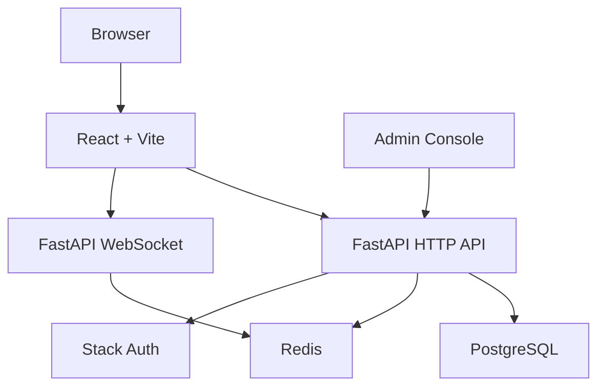

# Architecture

SKLinkChat 是一个前后端分离的匿名实时聊天系统。前端负责认证入口、聊天界面和管理后台；后端负责本地会话、匹配、WebSocket、举报和审计；PostgreSQL 保存业务数据；Redis 支撑实时状态。

## 总览

## 前端

- `client/src/app/App.tsx` 定义路由。
- `client/src/pages/retro-landing-page.tsx` 是公开首页。
- `client/src/pages/home-page.tsx` 是登录后的聊天入口。
- `client/src/features/chat/` 处理聊天界面、会话状态和 WebSocket。
- `client/src/features/admin/` 处理举报审核和审计后台。
- `client/src/features/auth/` 处理 Stack Auth 与本地会话同步。

## 后端

- `server-py/app/main.py` 是 ASGI 入口。
- `server-py/app/bootstrap/app_factory.py` 组装 FastAPI 应用。
- `server-py/app/presentation/http/routes/` 提供 HTTP API。
- `server-py/app/presentation/ws/chat_endpoint.py` 提供聊天 WebSocket。
- `server-py/app/application/` 放业务流程。
- `server-py/app/infrastructure/` 放 PostgreSQL、Redis、Stack Auth 等外部集成。

## 数据层

- PostgreSQL 保存账号、会话、举报、审计等持久数据。
- Redis 保存在线状态、匹配状态和实时事件。
- `database/schema.sql` 提供结构参考，不包含业务数据。

## 认证

Stack Auth 负责登录身份。本项目后端会把 Stack 身份同步成本地账号，并通过本地 session 支撑聊天和管理后台权限。

## 管理后台

管理员身份由数据库字段控制。管理后台通过后端 API 查询举报、执行账号限制、恢复账号并查看审计日志。

## 部署形态

本地推荐使用 Docker Compose 启动 PostgreSQL、Redis、后端和前端。生产环境可以使用 Nginx 或 Caddy 做反向代理，并把前端、HTTP API 和 WebSocket 暴露到同一域名下。
