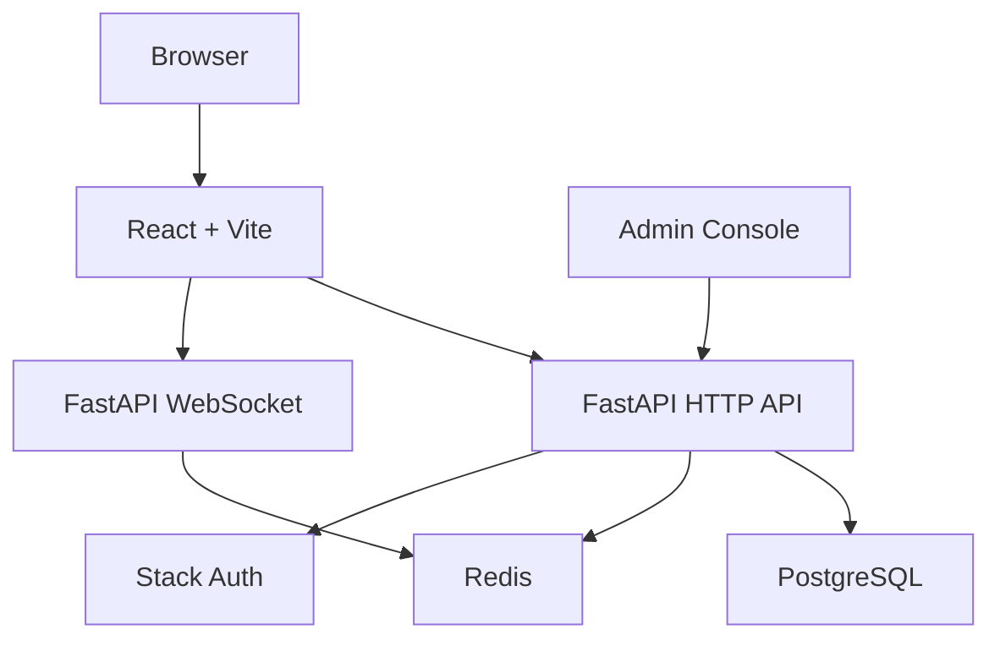

# Architecture / 架构

SKLinkChat is a separated frontend/backend anonymous real-time chat system. The frontend handles the public entry, authentication flow, chat workspace, and admin console. The backend handles local sessions, matching, WebSocket messaging, reports, moderation, and audit trails. PostgreSQL stores durable business data, while Redis supports realtime presence and matching state.

SKLinkChat 是一个前后端分离的匿名实时聊天系统。前端负责公开入口、认证流程、聊天界面和管理后台；后端负责本地会话、匹配、WebSocket、举报、审核和审计；PostgreSQL 保存业务数据；Redis 支撑在线状态和匹配状态。

## Overview / 总览

## Frontend / 前端

- `client/src/app/App.tsx`: routing entry.
- `client/src/pages/retro-landing-page.tsx`: public landing page.
- `client/src/pages/home-page.tsx`: signed-in chat entry.
- `client/src/features/chat/`: chat UI, session state, and WebSocket flow.
- `client/src/features/admin/`: report review and audit console.
- `client/src/features/auth/`: Stack Auth and local session synchronization.

## Backend / 后端

- `server-py/app/main.py`: ASGI entry.
- `server-py/app/bootstrap/app_factory.py`: FastAPI app factory.
- `server-py/app/presentation/http/routes/`: HTTP API routes.
- `server-py/app/presentation/ws/chat_endpoint.py`: chat WebSocket endpoint.
- `server-py/app/application/`: business workflows.
- `server-py/app/infrastructure/`: PostgreSQL, Redis, Stack Auth, and other integrations.

## Data Layer / 数据层

- PostgreSQL stores accounts, sessions, reports, account restrictions, and audit logs.
- Redis stores presence, matching state, and realtime events.
- `database/schema.sql` documents the schema without real business data.

## Authentication / 认证

Stack Auth provides user identity. The backend syncs Stack identity into a local account and uses the local session for chat and admin permissions.

Stack Auth 负责登录身份。本项目后端会把 Stack 身份同步成本地账号，并通过本地 session 支撑聊天和管理后台权限。

## Admin Console / 管理后台

Admin access is controlled by the database. The admin console calls backend APIs to review reports, restrict accounts, restore accounts, and inspect audit logs.

管理员身份由数据库字段控制。管理后台通过后端 API 查询举报、执行账号限制、恢复账号并查看审计日志。

## Deployment / 部署形态

For local previews, Docker Compose starts PostgreSQL, Redis, the backend, and the frontend together. In production, use Nginx or Caddy as a reverse proxy and expose the frontend, HTTP API, and WebSocket endpoint under the same domain.

本地推荐使用 Docker Compose 启动 PostgreSQL、Redis、后端和前端。生产环境可以使用 Nginx 或 Caddy 做反向代理，并把前端、HTTP API 和 WebSocket 暴露到同一域名下。
