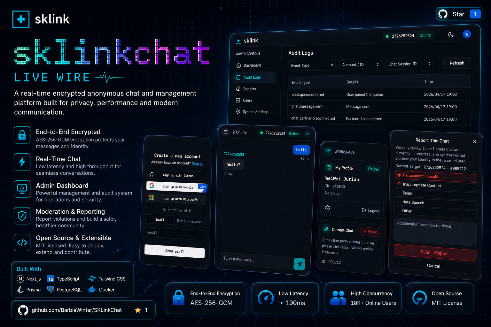
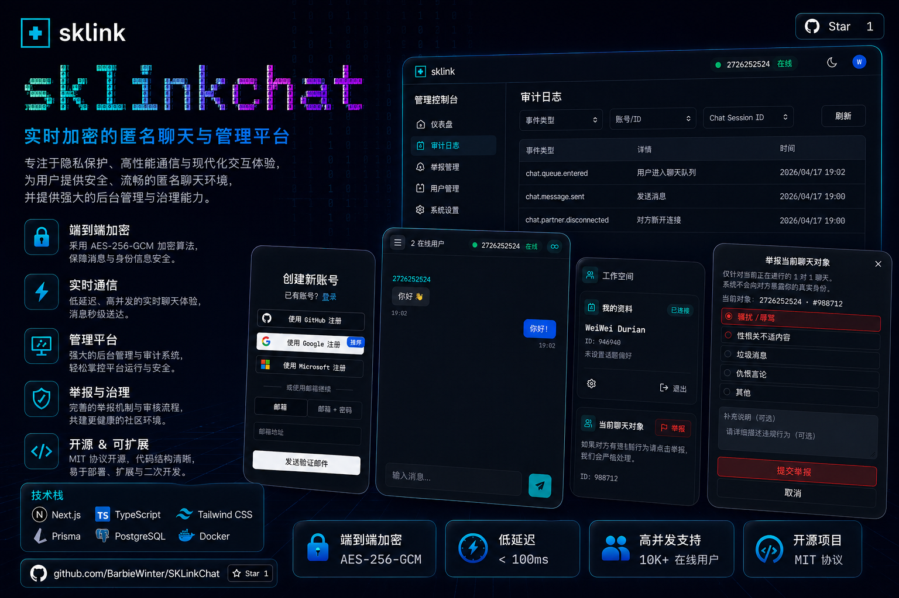

# Screenshots / 截图

This page collects SKLinkChat previews so first-time visitors can understand the product quickly.

这页集中展示 SKLinkChat 的界面预览，方便第一次打开仓库的人快速理解项目形态。

## English Preview

This image is designed for international visitors. It shows the landing page, auth entry, chat workspace, reporting flow, and admin audit console in one visual.

## 中文预览

这张图展示了项目的主要产品面：落地页、登录入口、实时聊天窗口、用户工作区、举报弹窗和管理后台审计视图。它适合放在 README 顶部，用来快速说明 SKLinkChat 不是单一聊天页面，而是一套包含认证、实时通信和后台治理的完整系统。

## 后续截图计划

- 首页完整首屏
- 聊天页桌面端
- 聊天页移动端
- 举报流程
- 管理后台举报页
- 管理后台审计页
- Docker 本地启动成功截图
